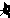

# pbm2svg

A simple program that takes a Portable Bitmap file (a matrix of ones and zeros, representing an image) and turns it into a vector graphic with a retro-look representation of those digits.

## Usage

As a minimum, this script needs an input file.
At this time, it must be an ASCII-formatted PBM
(Portable Bitmap) file.

```
./pbm2svg puppy.pbm
```

An optional but ideal second argument is the output file.

```
./pbm2svg puppy.pbm puppy.svg
```

Note that PBM is somewhat odd in that it assumes you are drawing
with black ink on a white canvas.  This means that a binary 0 represents
a white pixel and a 1 represents a black pixel.
If you are used to RGB, then you will be expecting higher values to be brighter.

To account for such quirks, you can throw in the `-i` flag,
to invert black and white.

### Input files

PBM files have the following format:

```
P1
# A depiction of the letter A.
6 5
001100
010010
011110
010010
010010
```

The `P1` makes it a PBM.
It’s common to have a comment on the next line.
The next non-comment line is the width and height of the image, separated by a space.

You then have a matrix of ones and zeros that represent the pixels.
You can break this up with whitespace (spaces and newlines) as you please.
If you choose to put all the pixels on one line, that’s fine because
the image viewer will still know that each line of the image is supposed to
be 6 pixels, to take the above image as an example.

Here is that image, blown up ×10 for ease of viewing.


You can also paint images in an editor such as The GIMP, and save as PBM in ASCII mode.

If you are having trouble viewing your PBM images, convert them to a different format.
Here is an example of a program you may use:

```
optipng -o7 A.pbm
```

#### Converting photos

Sometimes you have a pre-existing image, e.g. a photograph, that you may wish
to artistically modify in this manner.

Using an editor such as The GIMP or PhotoShop,
use the contrast or curve tool to make sure that
the image has a clear differentiation between light and dark areas.
Then reduce the image mode to 1-bit colour, i.e. monochrome.  If you got the
contrast right, it will now look like a mediaeval woodcut with areas of either
black or white.  Reduce the resolution of the image to a low level,
say 30 pixels across.  Save as PBM, in ASCII mode.

Then go ahead and run this script on it as usual.

Future versions of this script will automate the above steps, so that you will
need to do little or nothing in an image editor.

### Output files

The output of this script is always valid SVG.
At the time of writing, many image viewers do a poor job of displaying SVG.
Browsers are generally your best bet.  To convert an SVG to a raster format,
you can use Inkscape on the command line:

```
inkscape A.svg -w 100 -e A.png
```

Inkscape’s compression is very poor, so I recommend immediately
running the result through
`advpng`, `optipng` or `pngout`.

Here is the final result for the above ‘A’ image:


Here is an inverted version (better matching what the PBM looks like):


Here is a more complex image, at its normal size:
.
Notice that it’s half a cat.
Here’s the full thing:
.
If you want to draw a picture that has left-right symmetry, you can just
draw one side of it, add a comment containing the string ‘mirror’,
and this script will automatically mirror it for you as it converts to SVG.

Here is the final result:


## To-do

* Allow PNG input files.
* Automate conversion of photos.
* Allow customisation of the ones and zeros.

## Interpreter

Python ≥ 3.5

## Licence

All rights reserved.
